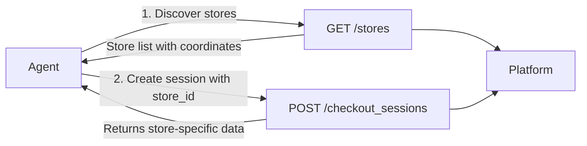
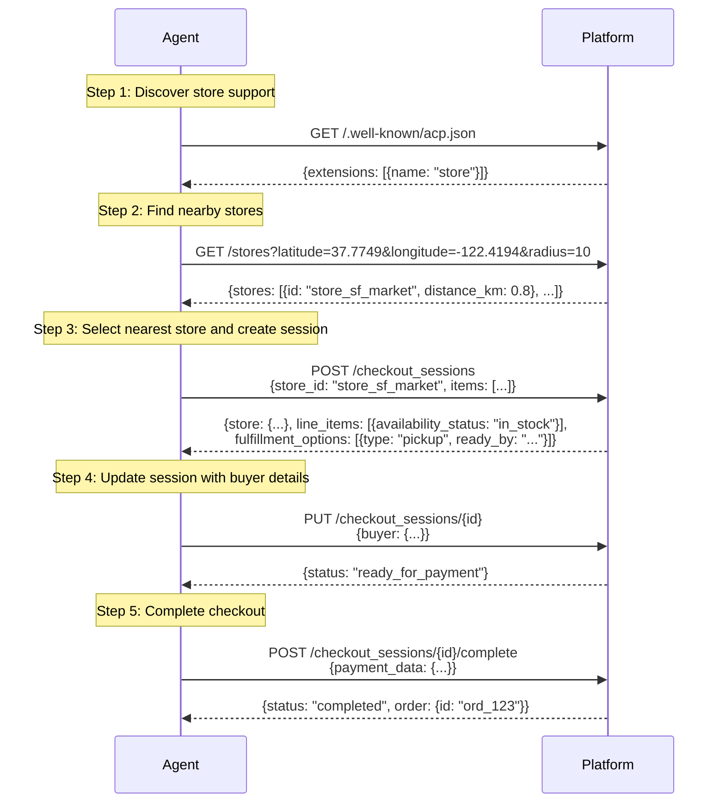
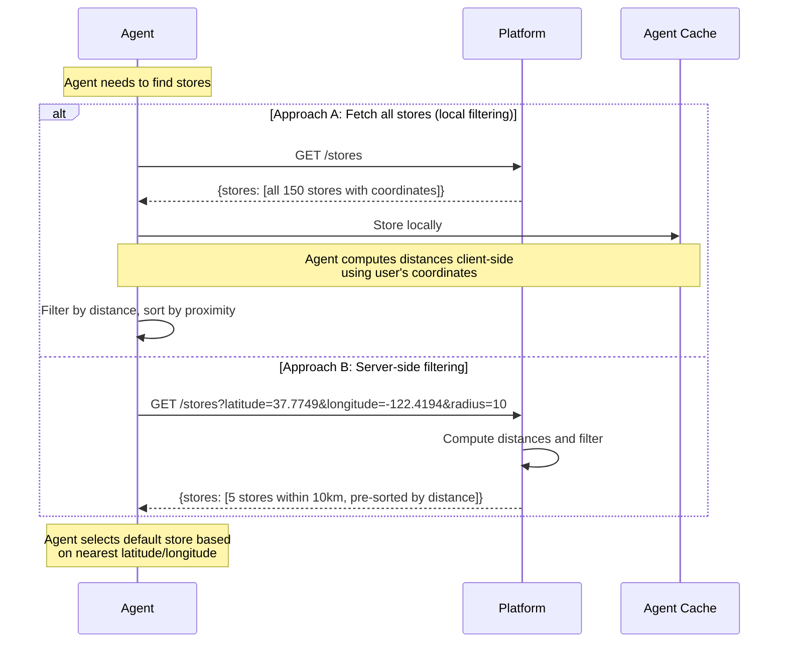
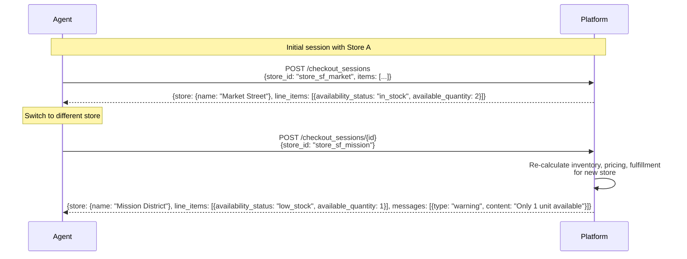

# RFC: Store Extension

**Status:** Proposal
**Version:** unreleased
**Scope:** Store context for localized inventory, pricing, and fulfillment
**Depends on:** RFC: ACP Extensions Framework

This RFC defines the **Store Extension**, an ACP extension that enables agents to specify a physical store location when creating or updating checkout sessions. This allows merchants to return store-specific inventory availability, pricing, and fulfillment options, supporting use cases like Buy Online Pick Up In Store (BOPIS), in-store assisted shopping, and store locator flows.

---

## 1. Scope & Goals

- Enable **store-aware checkout sessions** by adding optional `store_id` to requests
- Return **store-specific inventory and pricing** via existing line item fields
- Define **standard store discovery endpoint** at `GET /stores` for location-based search
- Support **BOPIS flows** (Buy Online, Pick Up In Store) with store-based fulfillment options
- Enable **in-store assisted shopping** for customers browsing while physically in a store
- Maintain **100% backward compatibility** as an optional extension

**Out of scope:** Store management APIs, inventory transfers between stores, advanced store search filters beyond proximity, real-time inventory sync mechanisms.

### 1.1 Normative Language

The key words **MUST**, **MUST NOT**, **SHOULD**, **MAY** follow RFC 2119/8174.

---

## 2. Motivation

### 2.1 Problem Statement

Current AI shopping agents lack the ability to provide store-specific inventory, pricing, and fulfillment information. This limitation affects two key stakeholders:

**For Agents:**

- Cannot determine product availability at specific physical store locations
- Unable to provide same-day pickup options requiring store-level inventory visibility
- Cannot offer accurate local pricing including regional taxes and promotions
- Cannot assist customers shopping within physical store locations

**For Merchants:**

- Cannot expose multi-location inventory through agent-driven commerce channels
- Unable to capture demand for Buy Online Pick Up In Store (BOPIS) transactions
- Cannot leverage physical store networks as a competitive advantage in agent commerce
- Unable to drive foot traffic from online channels to physical locations
- Cannot provide location-specific pricing and promotions through agents

### 2.2 Solution

This extension enables store-aware checkout sessions through three mechanisms:

**Request Context:**

- `store_id` parameter in checkout session create and update requests
- Signals merchant to provide store-specific data for the specified location

**Response Data:**

- `store` object containing location details (address, coordinates, services)
- Store-specific inventory status in existing `line_items` fields
- Store-based fulfillment options (pickup, ready times)

**Store Discovery:**

- `GET /stores` endpoint for location-based store search
- Supports both unfiltered queries and proximity-based filtering
- Returns store details, coordinates, and optional distance calculations

---

## 3. Use Cases

### 3.1 Buy Online, Pick Up In Store (BOPIS)

Enables same-day pickup transactions with store-specific inventory visibility.

**Flow:**

1. Agent queries `GET /stores` with user coordinates to find nearby locations
2. Agent selects default store based on nearest latitude/longitude
3. Agent creates checkout session with selected `store_id` parameter
4. Platform returns store-specific inventory status and pickup fulfillment options
5. User completes checkout with pickup fulfillment selected

**Technical Requirements:**

- `store_id` in `CheckoutSessionCreateRequest`
- `line_items[].availability_status` and `available_quantity` reflect store inventory
- `fulfillment_options[]` includes pickup option with `ready_by` timestamp
- `store` object in response contains location details

### 3.2 In-Store Assisted Shopping

Enables agents to assist customers browsing within physical store locations.

**Flow:**

1. Agent determines user is at specific store location (via geolocation or user context)
2. Agent creates checkout session with corresponding `store_id`
3. Platform returns inventory status specific to that physical location
4. User completes purchase with in-store pickup or takes items immediately

**Technical Requirements:**

- `store_id` identifies the physical location where user is present
- Inventory data reflects real-time stock at that specific location
- Fulfillment options may include immediate pickup or standard processing

### 3.3 Store Locator with Real-Time Inventory

Enables location-based search for stores with product availability.

**Flow:**

1. Agent queries `GET /stores?latitude={lat}&longitude={lng}&radius={km}`
2. Platform returns stores within specified radius, sorted by distance
3. Agent selects default store based on nearest latitude/longitude
4. Agent creates checkout session with selected `store_id` to verify inventory
5. User completes checkout with selected store

**Technical Requirements:**

- `GET /stores` endpoint with location filter parameters
- `distance_km` field in response when location filters applied
- Checkout session created with nearest store by default

### 3.4 Regional Pricing and Promotions

Enables store-specific pricing including local taxes and regional promotions.

**Flow:**

1. Agent creates checkout session with `store_id` for user's local store
2. Platform applies store-specific pricing rules
3. Response includes accurate totals with local tax rates
4. Regional promotions reflected in line item pricing

**Technical Requirements:**

- Store-specific pricing in `line_items[].unit_amount`
- Local tax calculation in `totals[]` array
- Regional discounts applied based on store location

---

## 4. Extension Declaration

Platforms advertise store extension support in `/.well-known/acp.json`:

```json
{
  "capabilities": {
    "extensions": [
      {
        "name": "store",
        "spec": "https://agenticcommerce.dev/specs/store",
        "schema": "https://agenticcommerce.dev/schemas/store.json"
      }
    ]
  }
}
```

Merchants return the extension in checkout session responses with field definitions:

```json
{
  "capabilities": {
    "extensions": [
      {
        "name": "store",
        "extends": [
          "$.CheckoutSessionCreateRequest.store_id",
          "$.CheckoutSessionUpdateRequest.store_id",
          "$.CheckoutSession.store"
        ],
        "spec": "https://agenticcommerce.dev/specs/store",
        "schema": "https://agenticcommerce.dev/schemas/store.json"
      }
    ]
  }
}
```

---

## 5. Architecture Overview

### 5.1 System Components



### 5.2 Extension Flow

The store extension is advertised in two places:

1. **Discovery Document** (`/.well-known/acp.json`) — Platform-level capability
2. **Checkout Session Response** — Session-level activation with field definitions

---

## 6. Complete BOPIS Flow

This diagram shows the full end-to-end flow for a Buy Online, Pick Up In Store transaction.



---

## 7. Store Discovery Flow

This diagram shows how agents discover and fetch store information.



### 7.1 When to Use Each Approach

| Approach        | Best For                        | Pros                                           | Cons                                               |
| --------------- | ------------------------------- | ---------------------------------------------- | -------------------------------------------------- |
| **Fetch All**   | < 1000 stores, frequent queries | Agent caching, offline support, custom ranking | Large initial payload, requires geocoding on agent |
| **Server-Side** | > 1000 stores, privacy concerns | Reduced bandwidth, platform controls data      | Extra API calls, no offline support                |

---

## 8. Store Context Update Flow

This diagram shows how store context can be changed during a session.



---

## 9. Technical Specification

### 9.1 Discovery Document

Platforms advertise store extension support in `/.well-known/acp.json`:

```json
{
  "protocol": {
    "name": "acp",
    "version": "2026-01-30"
  },
  "api_base_url": "https://acp.stripe.com/api",
  "capabilities": {
    "services": ["checkout"],
    "extensions": [
      {
        "name": "store",
        "spec": "https://agenticcommerce.dev/specs/store",
        "schema": "https://agenticcommerce.dev/schemas/store.json"
      }
    ]
  }
}
```

**Key Point:** The store discovery endpoint URL is NOT in the discovery document. It follows a standard path: `{api_base_url}/stores`.

### 9.2 Request Schema Extensions

The extension adds an optional `store_id` field to two request schemas:

| Request Type                   | Field      | Type              | Description                          |
| ------------------------------ | ---------- | ----------------- | ------------------------------------ |
| `CheckoutSessionCreateRequest` | `store_id` | string (optional) | Store identifier for initial context |
| `CheckoutSessionUpdateRequest` | `store_id` | string (optional) | Update store context mid-session     |

**Note:** `store_id` is NOT included in `CheckoutSessionCompleteRequest`. Changing store context at completion time would require full cart recalculation (inventory, pricing, taxes, fulfillment) during payment processing, creating race conditions and complexity. If the user wants to change stores, the session should be updated first via `POST /checkout_sessions/{id}`, then completed.

### 9.3 Response Schema Extensions

The extension adds a `store` field to the `CheckoutSession` response:

**Example Response:**

```json
{
  "id": "cs_abc123",
  "protocol": {
    "name": "acp",
    "version": "unreleased"
  },
  "status": "ready_for_payment",
  "currency": "usd",
  "store": {
    "id": "store_sf_market",
    "name": "San Francisco Market Street",
    "address": {
      "name": "San Francisco Market Street",
      "line_one": "123 Market Street",
      "city": "San Francisco",
      "state": "CA",
      "country": "US",
      "postal_code": "94102"
    },
    "phone_number": "+14155551234",
    "coordinates": {
      "latitude": 37.7749,
      "longitude": -122.4194
    },
    "business_hours": {
      "monday": "09:00-21:00",
      "tuesday": "09:00-21:00",
      "wednesday": "09:00-21:00",
      "thursday": "09:00-21:00",
      "friday": "09:00-21:00",
      "saturday": "10:00-20:00",
      "sunday": "11:00-19:00"
    },
    "services": ["pickup", "returns", "ship_from_store"],
    "timezone": "America/Los_Angeles"
  },
  "line_items": [
    {
      "id": "li_laptop_001",
      "product_id": "prod_laptop_pro",
      "title": "Laptop Pro 15-inch",
      "quantity": 1,
      "unit_amount": 149900,
      "availability_status": "in_stock",
      "available_quantity": 3
    }
  ],
  "totals": [
    {
      "type": "subtotal",
      "display_text": "Subtotal",
      "currency": "usd",
      "amount": 149900
    },
    {
      "type": "tax",
      "display_text": "Tax",
      "currency": "usd",
      "amount": 13116
    },
    {
      "type": "total",
      "display_text": "Total",
      "currency": "usd",
      "amount": 163016
    }
  ],
  "fulfillment_options": [
    {
      "id": "pickup_sf_market",
      "type": "pickup",
      "title": "Pick up at San Francisco Market Street",
      "amount": 0,
      "currency": "usd",
      "ready_by": "2026-03-02T14:00:00-08:00",
      "location": {
        "id": "store_sf_market",
        "name": "San Francisco Market Street",
        "address": {
          "name": "San Francisco Market Street",
          "line_one": "123 Market Street",
          "city": "San Francisco",
          "state": "CA",
          "country": "US",
          "postal_code": "94102"
        }
      }
    }
  ],
  "messages": [],
  "links": [],
  "capabilities": {
    "extensions": [
      {
        "name": "store",
        "extends": [
          "$.CheckoutSessionCreateRequest.store_id",
          "$.CheckoutSessionUpdateRequest.store_id",
          "$.CheckoutSession.store"
        ]
      }
    ]
  }
}
```

**Store Object Fields:**

| Field            | Type   | Required | Description                                        |
| ---------------- | ------ | -------- | -------------------------------------------------- |
| `id`             | string | Yes      | Unique store identifier                            |
| `name`           | string | Yes      | Store display name                                 |
| `address`        | object | No       | Store physical address                             |
| `phone_number`   | string | No       | Store contact phone number (E.164 format)          |
| `email`          | string | No       | Store contact email                                |
| `business_hours` | object | No       | Operating hours (keys: monday-sunday)              |
| `coordinates`    | object | No       | Geographic coordinates (latitude, longitude)       |
| `services`       | array  | No       | Services: pickup, returns, ship_from_store, curbside |
| `timezone`       | string | No       | IANA timezone (e.g., "America/Los_Angeles")        |
| `store_url`      | string | No       | URL to store details page                          |

### 9.4 Store Discovery Endpoint

**Endpoint:** `GET {api_base_url}/stores`

**Query Parameters:**

| Parameter     | Type    | Required | Default | Description                                  |
| ------------- | ------- | -------- | ------- | -------------------------------------------- |
| `latitude`    | number  | No       | -       | Latitude for proximity search (-90 to 90)    |
| `longitude`   | number  | No       | -       | Longitude for proximity search (-180 to 180) |
| `radius`      | number  | No       | 50      | Search radius in kilometers                  |
| `postal_code` | string  | No       | -       | Postal code for proximity search             |
| `city`        | string  | No       | -       | City name for location search                |
| `limit`       | integer | No       | 20      | Maximum results (1-100)                      |

**Example Response:**

```json
{
  "stores": [
    {
      "id": "store_sf_market",
      "name": "San Francisco Market Street",
      "address": {
        "name": "San Francisco Market Street",
        "line_one": "123 Market Street",
        "city": "San Francisco",
        "state": "CA",
        "country": "US",
        "postal_code": "94102"
      },
      "phone_number": "+14155551234",
      "coordinates": {
        "latitude": 37.7749,
        "longitude": -122.4194
      },
      "business_hours": {
        "monday": "09:00-21:00",
        "tuesday": "09:00-21:00",
        "wednesday": "09:00-21:00",
        "thursday": "09:00-21:00",
        "friday": "09:00-21:00",
        "saturday": "10:00-20:00",
        "sunday": "11:00-19:00"
      },
      "services": ["pickup", "returns", "ship_from_store"],
      "timezone": "America/Los_Angeles",
      "distance_km": 0.8
    },
    {
      "id": "store_sf_mission",
      "name": "Mission District Store",
      "address": {
        "name": "Mission District Store",
        "line_one": "456 Mission Street",
        "city": "San Francisco",
        "state": "CA",
        "country": "US",
        "postal_code": "94110"
      },
      "phone_number": "+14155555678",
      "coordinates": {
        "latitude": 37.7599,
        "longitude": -122.4148
      },
      "services": ["pickup", "returns"],
      "timezone": "America/Los_Angeles",
      "distance_km": 2.1
    }
  ]
}
```

**Note:** The `distance_km` field is only present when location-based filtering is used.

**Behavior:**

- **No query params**: Returns all stores (optionally paginated)
- **With location params**: Returns stores filtered by proximity, sorted by distance

---

## 10. Impact on Existing Fields

The store extension does NOT add new fields to line items. It makes existing fields **store-context-aware**:

| Existing Field          | Store-Context Behavior                                |
| ----------------------- | ----------------------------------------------------- |
| `availability_status`   | Reflects inventory at specified store                 |
| `available_quantity`    | Quantity available at specified store                 |
| `unit_amount`           | May reflect store-specific pricing                    |
| `totals[].tax`          | Store location affects tax jurisdiction               |
| `fulfillment_options[]` | Platform includes store-based pickup/delivery options |

**Example:**

```json
{
  "store_id": "store_sf_market"
}
```

Results in:

```json
{
  "store": {
    "id": "store_sf_market",
    "name": "San Francisco Market Street"
  },
  "line_items": [
    {
      "availability_status": "in_stock", // At THIS store
      "available_quantity": 5 // At THIS store
    }
  ],
  "fulfillment_options": [
    {
      "type": "pickup",
      "title": "Pick up at San Francisco Market Street",
      "location": {
        "id": "store_sf_market",
        "name": "San Francisco Market Street"
      }
    }
  ]
}
```

---

## 11. Error Handling

### 11.1 Invalid Store ID

**Request:**

```json
POST /checkout_sessions
{
  "store_id": "invalid_store_999",
  "line_items": [{"id": "item_123", "quantity": 1}]
}
```

**Response: 400 Bad Request**

```json
{
  "type": "invalid_request",
  "code": "invalid",
  "message": "Store 'invalid_store_999' not found or not available",
  "param": "$.store_id"
}
```

### 11.2 Out of Stock at Store

**Response: 200 OK** (with warning message)

```json
{
  "status": "not_ready_for_payment",
  "store": {
    "id": "store_sf_mission",
    "name": "Mission District Store"
  },
  "line_items": [
    {
      "availability_status": "out_of_stock",
      "available_quantity": 0
    }
  ],
  "messages": [
    {
      "type": "error",
      "code": "out_of_stock",
      "param": "$.line_items[0]",
      "resolution": "recoverable",
      "content": "This item is not available at Mission District Store. Check other stores or try shipping."
    }
  ]
}
```

---

## 12. Backward Compatibility

✅ **100% backward compatible:**

- New optional fields only (`store_id` in requests, `store` in responses)
- No breaking changes to existing request/response schemas
- Default behavior preserved when `store_id` is omitted
- Clients not supporting the extension can ignore the `store` field
- Opt-in via capability negotiation

---

## 13. Conformance Checklist

Platforms implementing the Store Extension MUST:

- [ ] Advertise `store` extension in `/.well-known/acp.json`
- [ ] Accept `store_id` in create and update requests
- [ ] Return `store` object in responses when `store_id` is provided
- [ ] Return store-specific inventory (`availability_status`, `available_quantity`)
- [ ] Generate store-based fulfillment options when applicable
- [ ] Validate `store_id` and return 400 for invalid IDs
- [ ] Include store-related errors in `messages[]` array

Platforms implementing the Store Extension SHOULD:

- [ ] Implement `GET /stores` endpoint with location filtering
- [ ] Support both fetch-all and proximity-filtered queries
- [ ] Return stores sorted by distance when filtering
- [ ] Include `distance_km` in filtered results
- [ ] Apply rate limiting to store discovery endpoint
- [ ] Cache store data with appropriate TTL

---

## 14. References

- [RFC: Extensions Framework](rfc.extensions.md)
- [RFC: Discovery](rfc.discovery.md)
- [RFC: Agentic Checkout](rfc.agentic_checkout.md)
- [Store Extension Proposal](../PROPOSAL_store_extension.md)

---

## 15. Change Log

- **2026-03-02**: Initial RFC draft with goals, flows, and specification
